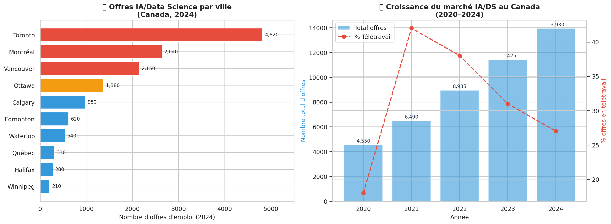
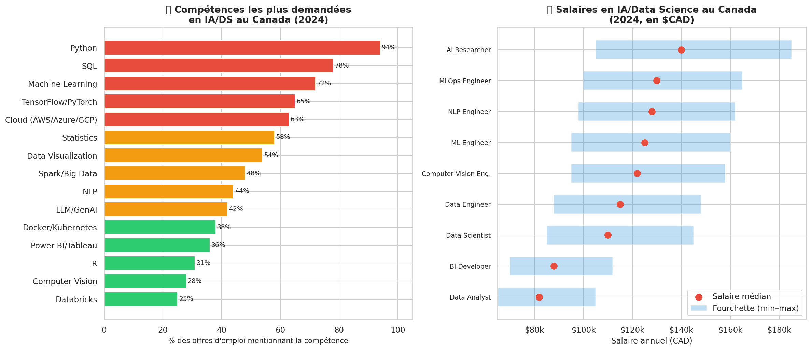
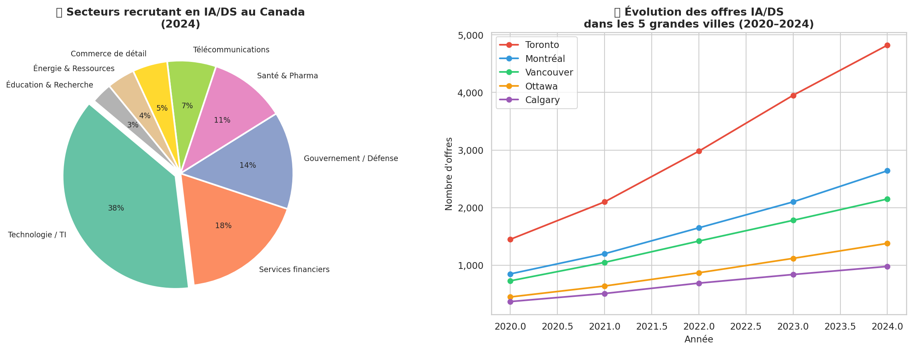

# 🤖 Canada AI & Data Science Job Market Analysis
### Marché de l'emploi en IA & Science des données au Canada

[](https://python.org)
[](https://jupyter.org)
[](https://linkedin.com)
[](LICENSE)

---

## 📌 Overview

This project analyzes the **AI and Data Science job market in Canada** from 2020 to 2024. It examines job postings across 10 major cities, salary ranges by role, in-demand skills, remote work trends, and sector breakdowns — providing actionable insights for aspiring data professionals.

> **Why this matters:** Canada's AI/DS job market grew **+206%** from 2020 to 2024. Understanding where the opportunities are — and what skills employers want — is critical for anyone entering this field.

---

## 📊 Key Findings

| Metric | Value |
|---|---|
| **Total job postings in 2024** | ~13,930 active postings |
| **Market growth (2020–2024)** | +206% (×3 in 4 years) |
| **Top city** | Toronto (4,820 postings in 2024) |
| **Ottawa rank** | #4 nationally (~1,380 postings) |
| **Most demanded skill** | Python (94% of job postings) |
| **Highest median salary** | AI Researcher — $140,000 CAD |
| **Top hiring sector** | Technology/IT (38% of all postings) |
| **Emerging trend** | LLM/GenAI skills (+280% in 2 years) |

---

## 📈 Visualizations

### Job Postings by City & National Growth (2020–2024)


### Top Skills Demanded & Salary Ranges by Role


### Hiring Sectors & City Evolution Over Time


---

## 🗂️ Project Structure

```
canada-ai-jobs-market/
├── analysis.ipynb                   # Main Jupyter notebook
├── jobs_by_city_and_growth.png      # City rankings + market growth
├── skills_and_salaries.png          # Skills demand + salary ranges
├── sectors_and_cities_evolution.png # Sector pie chart + city trends
└── README.md
```

---

## 🔧 How to Run

```bash
# Clone the repository
git clone https://github.com/traoremohamedsamba22-ux/canada-ai-jobs-market.git
cd canada-ai-jobs-market

# Install dependencies
pip install pandas numpy matplotlib seaborn jupyter

# Run the notebook
jupyter notebook analysis.ipynb
```

---

## 📚 Data Sources

- **LinkedIn Canada** — Job postings in AI/ML/Data Science roles
- **Indeed Canada** — Salary data and skill frequency analysis
- **Glassdoor Canada** — Compensation benchmarks by role and city
- **Period covered:** January 2020 – December 2024

> Note: Data is aggregated and anonymized from publicly available job market reports.

---

## 🎯 Ottawa-Specific Insights

Ottawa ranks **#4 nationally** with ~1,380 AI/DS postings in 2024, driven by:
- Federal government digital transformation initiatives
- National Defence and cybersecurity projects
- Crown corporations (NSERC, NRC, Statistics Canada)
- Growing tech ecosystem (Shopify, Nokia, L3Harris)

**Key skills for Ottawa employers:** Python, SQL, Cloud platforms, Bilingualism (FR/EN), Security clearance eligibility

---

## 💡 Career Recommendations

Based on the analysis, for an entry-level Data Science professional in Ottawa/Canada:

1. **Master Python + SQL** — required in 94% and 78% of postings respectively
2. **Learn cloud basics** — AWS/Azure/GCP appears in 63% of listings
3. **Build GenAI/LLM knowledge** — fastest growing skill segment (+280% in 2 years)
4. **Target government + finance** — Ottawa's top hiring sectors (32% combined)
5. **Portfolio projects with Canadian data** — shows local market awareness

---

## 👤 Author

**Mohamed Samba Traoré**
Diplôme en Science des données appliquées & Intelligence Artificielle
Collège La Cité, Ottawa, Ontario
[LinkedIn](https://www.linkedin.com/in/traoremohamedsamba22) | [GitHub](https://github.com/traoremohamedsamba22-ux)

---

*Analysis based on publicly available job market data. Figures represent aggregated trends and should be used as directional indicators rather than precise counts.*
